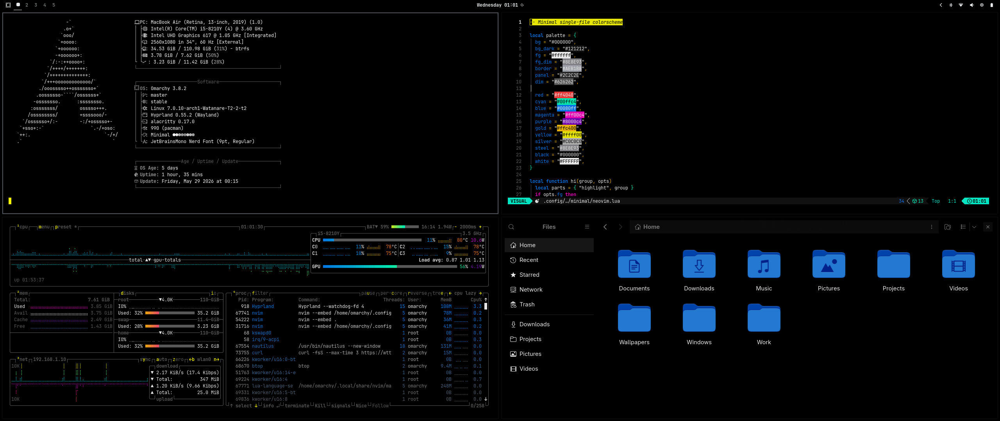
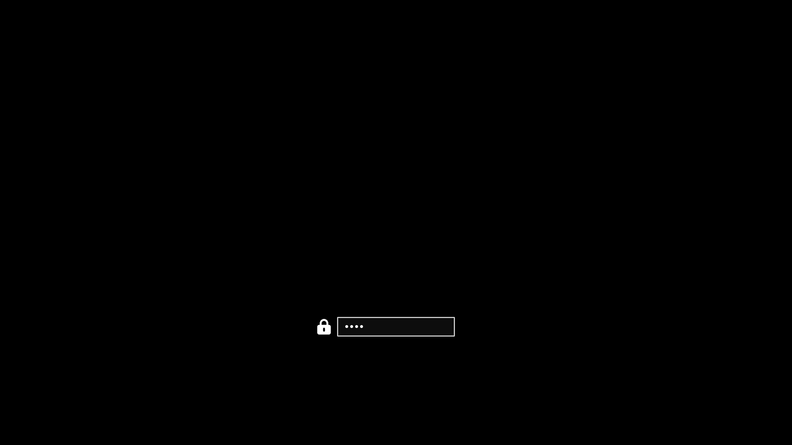

# Nocturne Omarchy Theme

Nocturne is a high-contrast dark color scheme designed for productivity-focused development environments and minimalist desktop configurations. Engineered around a pure black (`#000000`) background, the theme combines precise syntax token highlights—such as yellow comments, blue keywords, cyan numeric literals, magenta control flow statements, and gold operators—with refined UI components to deliver a unified visual interface across text editors, terminal emulators, and system desktop applications.




## Color Palette Specification

| Token / Layer | Hex Value | Application / Scope |
| :--- | :--- | :--- |
| **Canvas Background** | `#000000` | Primary editor background, terminal canvas, window frame |
| **Line Highlight / Panels** | `#121212` | Active line highlight, status bar, panel backgrounds |
| **Borders & Dividers** | `#2C2C2E` | Container borders, structural UI separation lines |
| **Primary Foreground** | `#ffffff` | Standard source code text, identifiers, default UI text |
| **Muted Foreground** | `#626262` | Line numbers, subtle annotations, disabled controls |
| **Comments & Cursor** | `#ffff00` | Code comments, active block cursor |
| **Keywords & Identifiers** | `#0080ff` | Language keywords, active tab highlights, hyper-links |
| **Control Flow** | `#ff00c4` | Control keywords (`if`, `else`, `return`, `yield`, `try`) |
| **Numeric Literals** | `#00ffc4` | Integers, floating-point numbers, boolean values |
| **Operators** | `#ffc400` | Arithmetic, relational, and logical operators |
| **Macros & Attributes** | `#8000c4` | Preprocessor directives, macros, code attributes |

## Ecosystem and Platform Support

Nocturne provides native configuration files across a broad suite of developer tooling:

- **Text Editors:** Neovim (`neovim.lua`), Zed (`zed.json`), Visual Studio Code (`vscode_colors.json`)
- **Terminal Emulators:** Alacritty (`alacritty.toml`), Ghostty (`ghostty.conf`), Kitty (`kitty.conf`), Foot (`foot.ini`)
- **System & Shell Interfaces:** Firefox (`firefox.css`), GTK 3.0 / 4.0 (`gtk.css`), Hyprland (`hyprland.conf`), Waybar (`waybar.css`), Walker (`walker.css`), Btop (`btop.theme`)

## Installation

### One-Line Quick Install

Execute the installation command directly in your shell:

```bash
bash <(curl -s https://raw.githubusercontent.com/leonardo-saran/nocturne-omarchy-theme/main/install.sh)
```

### Manual Repository Installation

Alternatively, clone the repository and run the installation script locally:

```bash
git clone https://github.com/leonardo-saran/nocturne-omarchy-theme.git
cd nocturne-omarchy-theme
chmod +x install.sh
./install.sh
```

### Execution Modes and Options

During interactive execution, the installer detects installed applications and presents an interactive TUI multi-select menu:

```text
Select target applications to install Nocturne theme:
  [X] Neovim
  [X] Zed Editor
  [X] VS Code
  [X] Firefox
  [X] Alacritty Terminal
  [X] GTK Theme

Controls: [↑/↓] Navigate  [Space] Toggle  [a] Toggle All  [Enter] Confirm  [q] Quit
```

To execute non-interactively and bypass the TUI menu, supply the `-y` or `--yes` flag:

```bash
bash <(curl -s https://raw.githubusercontent.com/leonardo-saran/nocturne-omarchy-theme/main/install.sh) -y
```

## Uninstallation

### One-Line Quick Uninstall

Execute the uninstallation command directly in your shell:

```bash
bash <(curl -s https://raw.githubusercontent.com/leonardo-saran/nocturne-omarchy-theme/main/uninstall.sh)
```

### Manual Repository Uninstallation

Alternatively, clone the repository (if not already local) and execute the uninstallation script:

```bash
git clone https://github.com/leonardo-saran/nocturne-omarchy-theme.git
cd nocturne-omarchy-theme
chmod +x uninstall.sh
./uninstall.sh
```

### Unattended Uninstallation

To run non-interactively and automatically remove theme configurations for all detected targets:

```bash
bash <(curl -s https://raw.githubusercontent.com/leonardo-saran/nocturne-omarchy-theme/main/uninstall.sh) -y
```

## License

This project is licensed under the MIT License. Refer to the `LICENSE` file for full terms and conditions.
